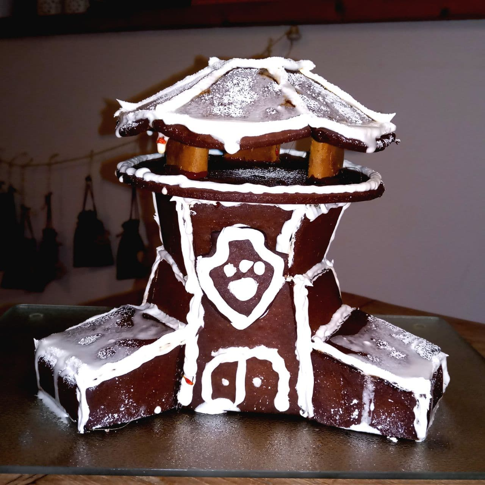

# Lebkuchenzentrale

Die Paw-Patrol-Zentrale als Lebkuchenhaus.

> Ich schwanke zwischen „Wo gibts die Anleitung?“ und „Muss das?“?
> 
> – @[Stephan_Mak](https://twitter.com/Stephan_Mak/status/1468671888499093507)

## Schritt 1: Vorlage vorbereiten

Das ist einfach: Die Vorlage ausdrucken und die Teile ausschneiden.

## Schritt 2: Lebkuchen backen

Ich habe mich an [dieses Rezept](https://www.einfachbacken.de/rezepte/lebkuchenhaus-einfach-selbstgemacht) gehalten, aber es geht vermutlich jedes andere. Man braucht die Teile in der jeweils angegebenen Anzahl.

Für die Dachstützen habe ich Stücke von Printen genommen, aber auch die kann man natürlich auch aus Lebkuchen backen.

## Schritt 3: Zusammenkleben

Bei einer solchen Konstruktion vertraue ich nicht auf Zuckerguss (obwohl der aus dem verlinkten Rezept wirklich nah an Zement ist). Ich nehme Karamell: 100g Zucker, zwei Esslöffel Wasser, bei mittlerer Hitze erwärmen, bis der Zucker schmilzt und leicht bräunt. Dann muss es schnell gehen. Und **Vorsicht!** Das Zeug ist tierisch heiß! Jeweils die Seiten kurz ins Karamell tauchen und dann zusammenkleben. Das ist noch eine kurze Zeit etwas flexibel und erlaubt Korrekturen, härtet aber dann schnell aus (und hält sehr fest).

Erst das Dach (dazu braucht man einen Eierbecher o.ä. als Stütze).

Dann die beiden Teile des Turms: Jeweils die sechs Teile zusammenkleben, die halten durch die leichte Neigung gut zusammen. Das kleinere Teil dann umdrehen, in den Karamell tauchen und auf das große Teil setzen. Die obere Seite wieder eintauchen und die Platte aufsetzen.

Dann die Stützen anbringen: Jeweils von zwei Seitenteilen gleich alle drei Seiten in den Karamell tauchen (ggf. eine Zange nehmen, damit man sich nicht verbrennt), an den Turm ansetzen, dann die obere Platte und das Abschlussstück ansetzen.

Die Printen-Stützen und das Dach aufsetzen.

## Schritt 4: Verzieren

Mit dem Zuckerguss (ich habe nur zwei Eiweiß genommen, und schon das ist eigentlich zu viel und benötigt Unmengen an Puderzucker. Vermutlich reicht auch eins.) und einer Spritztüten die Nähte noch einmal nachziehen. Das gibt zusätzlichen Halt und sieht schöner aus. Die Tür (und nach Belieben weitere Details) aufmalen. Man kann natürlich auch im klassischen Lebkuchenhaus-Stil weitere Süßigkeiten aufkleben.

Das Paw-Patrol-Abzeichen bemalen und mit dem Zuckerguss ankleben.

Den Zuckerguss ggf. mit etwas Wasser verdünnen und als Schnee aufs Dach aufbringen (Vorsicht: tropft, soll es für den Effekt aber auch). Danach noch etwas Puderzucker auf’s Dach streuen.

## Schritt 5: Sich der Kritik stellen

Ja, ich weiß, das Fernrohr und die Rutsche fehlen. 🙄 Dazu ist mir bislang noch nichts eingefallen. Vorschläge willkommen!
